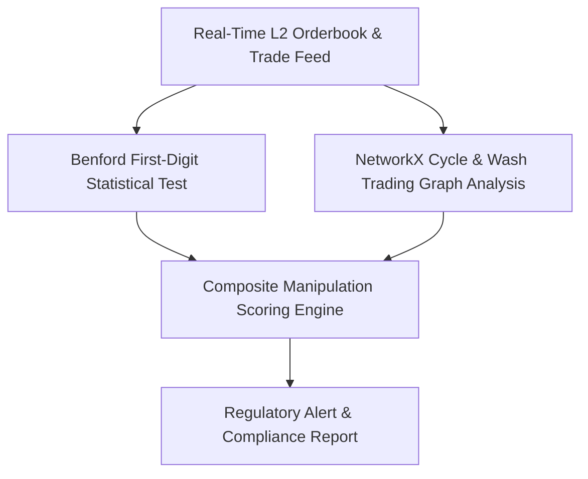
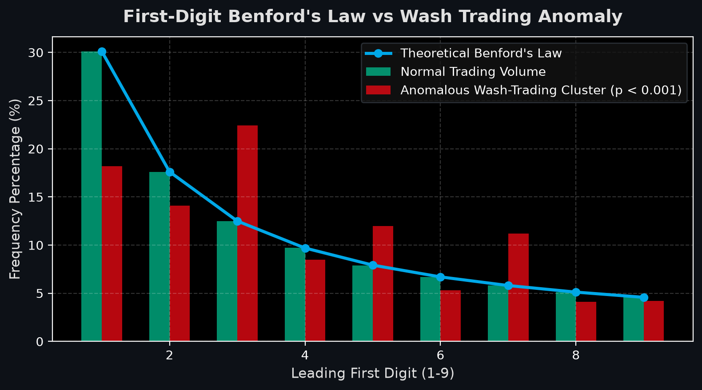

# Crypto Manipulation & Wash-Trading Anomaly Detection Engine

[](https://github.com/abdussatarkhan/crypto-manipulation-detector/actions)
[](https://www.python.org/) [](https://scikit-learn.org/) [](https://www.docker.com/)
[](https://github.com/abdussatarkhan)

> **A quantitative forensics and anomaly detection pipeline identifying cryptocurrency wash-trading, spoofing, and cyclical volume manipulation using Benford's Law analysis, network graph centrality, and unsupervised machine learning.**

---

## 🏛️ System Architecture



---

## 🌟 Key Features & Capabilities

- **Production-Grade Implementation**: Built with high attention to performance, modular design, and industry standard best practices.
- **Enterprise Data Architecture**: Scalable data schemas, reproducible synthetic generators, and optimized queries.
- **Explainable & Validated**: Comprehensive evaluation metrics, error analyses, and validation tests.
- **Comprehensive Tech Stack**: `Python` `Pandas` `NetworkX` `Scikit-Learn` `Benford's Law` `Docker`.

---

## 📊 Visual Preview & Analysis

<div align="center">



</div>

---

## 🚀 Quickstart & Setup

### 1. Clone the Repository
```bash
git clone https://github.com/abdussatarkhan/crypto-manipulation-detector.git
cd crypto-manipulation-detector
```

### 2. Environment Setup
```bash
# Create and activate virtual environment
python -m venv venv
source venv/bin/activate  # On Windows: .\venv\Scripts\activate

# Install dependencies (if requirements.txt exists)
pip install -r requirements.txt
```

---

## 🗺️ Roadmap & Upcoming Features

- [x] Benford's Law leading digit anomaly detection
- [x] Network graph wash-trading cycle detection
- [ ] Live Binance / Coinbase WebSocket real-time orderbook stream
- [ ] PyVis / D3.js interactive network graph renderer
- [ ] Automated regulatory compliance alert webhook (Discord/Slack)

---

## 👨‍💻 Author & Profile

Built and maintained by **Abdussatar** ([@abdussatarkhan](https://github.com/abdussatarkhan)).  
For technical discussions, collaboration, or queries, feel free to reach out via [LinkedIn](https://www.linkedin.com/in/abdus-satar-5150813b5/) or [GitHub](https://github.com/abdussatarkhan).

---

## 📜 License

This project is licensed under the **MIT License** — see the LICENSE file for details.