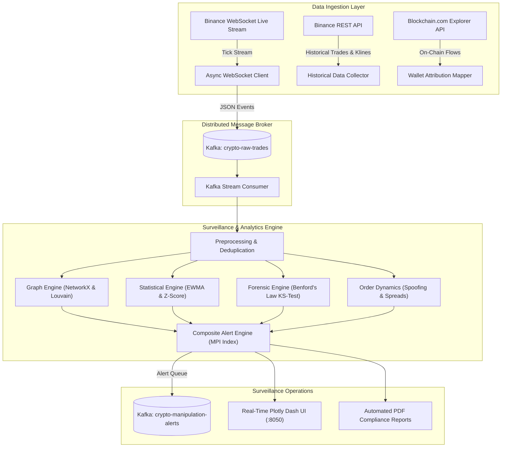

# ⚡ Real-Time Crypto Wash-Trade & Market Manipulation Detector

[](https://www.python.org/)
[](https://kafka.apache.org/)
[](https://networkx.org/)
[](https://dash.plotly.com/)
[](https://www.docker.com/)
[](LICENSE)

An institutional-grade, real-time market surveillance engine designed to detect **cryptocurrency wash trading, circular transaction syndicates, quote spoofing, and statistical market manipulation** across centralized (Binance) and decentralized order books and on-chain transaction graphs.

---

## 📌 Table of Contents
1. [Executive Summary & Problem Statement](#-executive-summary--problem-statement)
2. [End-to-End System Architecture](#-end-to-end-system-architecture)
3. [Core Detection Methodologies](#-core-detection-methodologies)
   - [A. Counterparty Graph Analysis (Wash Rings)](#a-counterparty-graph-analysis-wash-rings)
   - [B. Streaming Statistical Anomaly Detection (EWMA)](#b-streaming-statistical-anomaly-detection-ewma)
   - [C. Forensic Benford's Law Testing](#c-forensic-benfords-law-testing)
   - [D. Multi-Modal Composite Scoring (MPI)](#d-multi-modal-composite-scoring-mpi)
4. [Project Structure](#-project-structure)
5. [Prerequisites & Installation](#-prerequisites--installation)
6. [Quickstart Guide](#-quickstart-guide)
   - [1. Infrastructure Setup (Docker + Kafka)](#1-infrastructure-setup-docker--kafka)
   - [2. Real-Time Streaming Ingestion](#2-real-time-streaming-ingestion)
   - [3. Running the Surveillance Consumer](#3-running-the-surveillance-consumer)
   - [4. Launching the Real-Time Plotly Dash Dashboard](#4-launching-the-real-time-plotly-dash-dashboard)
   - [5. Automated PDF Compliance Report Generation](#5-automated-pdf-compliance-report-generation)
7. [Jupyter Notebooks Walkthrough](#-jupyter-notebooks-walkthrough)
8. [Regulatory Compliance & Evidentiary Standards](#-regulatory-compliance--evidentiary-standards)

---

## 📊 Executive Summary & Problem Statement

Cryptocurrency exchanges frequently suffer from artificial volume inflation and manipulative trading schemes:
* **Wash Trading**: Colluding entities simultaneously buy and sell identical financial assets to create illusory trading volume, distorting token rankings and liquidity rankings on tracking portals (e.g., CoinMarketCap, CoinGecko).
* **Spoofing & Layering**: Submitting large non-bona fide limit orders to manipulate the bid-ask spread and price expectations before quickly canceling them once retail participants react.
* **Robotic Flow**: Algorithmic market participants creating unnatural volume patterns that systematically breach natural statistical distributions.

This repository provides a production-ready financial intelligence platform that unifies **graph theory, statistical process control (SPC), forensic accounting, and real-time event streaming** to flag suspicious activity with sub-second latency.

---

## 🏗 End-to-End System Architecture



---

## 🔬 Core Detection Methodologies

### A. Counterparty Graph Analysis (Wash Rings)
* **Transaction Graph Construction**: Models trades as a directed graph $G = (V, E)$, where vertices $V$ represent wallet addresses and directed edges $E$ represent volume transferred between counterparties.
* **Cycle Detection**: Uses Johnson's elementary cycle algorithm to isolate circular trade loops ($A \to B \to C \to A$) where assets circulate with zero economic shift.
* **Louvain Modularity Partitioning**: Segregates the counterparty graph into dense trading syndicates.
* **Centrality Profiling**: Analyzes Betweenness Centrality and PageRank to spot orchestrator wallets operating as liquidity funnels.

### B. Streaming Statistical Anomaly Detection (EWMA)
* **Exponentially Weighted Moving Average (EWMA)**: Tracks dynamic mean and variance for high-frequency trading volume:
  $$z_t = \lambda x_t + (1 - \lambda) z_{t-1}$$
* **Dynamic Control Limits**: Establishes upper and lower bounds at $\mu_t \pm 3 \sigma_t$ to flag volume flash surges without manual static thresholding.
* **Order Book Cancellation Surveillance**: Tracks the cancel-to-fill ratio and spread volatility surges to identify spoofing and quote stuffing bursts.

### C. Forensic Benford's Law Testing
* **First-Digit Distribution**: Tests trade quantities against Newcomb-Benford distribution:
  $$P(d) = \log_{10}\left(1 + \frac{1}{d}\right) \quad \text{for } d \in \{1, \dots, 9\}$$
* **Hypothesis Testing**:
  * **Kolmogorov-Smirnov (KS) Test**: Evaluates empirical vs. theoretical cumulative distribution functions.
  * **Mean Absolute Deviation (MAD)**: Categorizes datasets into Nigrini (2012) compliance levels (Close, Acceptable, Marginally Acceptable, Manipulated).
  * **Chi-Square Goodness-of-Fit**: Quantifies statistical significance of robotic repetitive trade lots.

### D. Multi-Modal Composite Scoring (MPI)
Calculates a unified **Manipulation Probability Index (MPI)**:
$$\text{MPI} = 0.35 \cdot S_{\text{graph}} + 0.25 \cdot S_{\text{volume}} + 0.20 \cdot S_{\text{benford}} + 0.20 \cdot S_{\text{spoofing}}$$
* **0.00 – 0.35**: `LOW RISK` (Organic market operations)
* **0.35 – 0.65**: `MEDIUM RISK` (Surveillance watchlist)
* **0.65 – 0.85**: `HIGH RISK` (Investigation priority)
* **0.85 – 1.00**: `CRITICAL RISK` (Immediate regulatory alert / freeze candidate)

---

## 📁 Project Structure

```
crypto-manipulation-detector/
├── .gitignore
├── README.md
├── requirements.txt
├── docker-compose.yml
├── config/
│   └── config.yaml                     # Central parameters, thresholds & endpoints
├── data/
│   ├── raw/
│   │   └── README.md                   # API ingestion guide and rate limits
│   └── processed/
│       └── .gitkeep
├── scripts/
│   ├── utils.py                        # Logging, YAML config, synthetic generators, EWMA math
│   ├── data_collection_historical.py   # Binance REST API client for klines & aggTrades
│   ├── websocket_ingestion.py          # AsyncIO Binance WebSocket client with Kafka publisher
│   ├── kafka_consumer.py               # Trade stream consumer & real-time deduplicator
│   ├── preprocessing.py                # Tick normalization, outlier wicks, wallet attribution
│   ├── graph_analysis.py               # NetworkX & Louvain wash-trade ring analysis
│   ├── anomaly_detection.py            # EWMA control charts & sliding-window Z-scores
│   ├── benfords_law.py                 # Forensic KS-test and digit distribution tests
│   └── alert_scoring.py                # Composite Manipulation Probability Index engine
├── notebooks/
│   ├── 01_data_exploration.py          # Trade dynamics, arrival intervals, OHLCV bars
│   ├── 02_graph_analysis.py            # Directed network graph & cycle walkthrough
│   ├── 03_anomaly_detection.py         # EWMA control charts & spoofing ratio analysis
│   ├── 04_benfords_analysis.py         # First-digit distribution vs Benford curve
│   └── 05_composite_scoring.py         # Multi-modal radar scoring & alert triage
├── app/
│   ├── dash_app.py                     # Real-time Plotly Dash monitoring dashboard
│   └── assets/
│       └── style.css                   # Custom dark fintech responsive styling
├── reports/
│   └── compliance_report_template.py   # Automated institutional PDF audit generator
├── models/
│   └── .gitkeep
└── images/
    └── .gitkeep
```

---

## ⚙️ Prerequisites & Installation

### Environment Setup
* Python 3.10+
* Docker & Docker Compose (optional, for Kafka infrastructure)

```bash
# 1. Clone repository
git clone https://github.com/satarabdus692-bot/crypto-manipulation-detector.git
cd crypto-manipulation-detector

# 2. Create virtual environment
python -m venv .venv
source .venv/bin/activate  # On Windows: .venv\Scripts\activate

# 3. Install dependencies
pip install -r requirements.txt
```

---

## 🚀 Quickstart Guide

### 1. Infrastructure Setup (Docker + Kafka)
Launch local Kafka broker, Zookeeper, and Kafka-UI:
```bash
docker-compose up -d
```
* Kafka Broker: `localhost:9092`
* Kafka Web UI: `http://localhost:8080`

*(Note: If running without Docker, all scripts automatically switch to internal high-speed memory buffers for seamless local execution!)*

### 2. Real-Time Streaming Ingestion
Ingest live trades from Binance WebSocket API and stream to Kafka:
```bash
python scripts/websocket_ingestion.py --symbols btcusdt ethusdt solusdt --duration 60
```

### 3. Running the Surveillance Consumer
Consume trade ticks, execute real-time deduplication, and flag anomalies:
```bash
python scripts/kafka_consumer.py --max-messages 500
```

### 4. Launching the Real-Time Plotly Dash Dashboard
Launch the interactive live monitoring UI:
```bash
python app/dash_app.py
```
Open **`http://127.0.0.1:8050`** in your browser to view:
* Real-time Manipulation Probability Index (MPI) gauge
* Live EWMA control charts with dynamic +3σ control limits
* Benford's Law empirical vs theoretical distribution bars
* Directed counterparty transaction graph with wash cycles highlighted
* Live streaming regulatory alerts log

### 5. Automated PDF Compliance Report Generation
Compile an institutional Suspicious Activity Report (SAR):
```bash
python reports/compliance_report_template.py --output reports/generated/audit_report.pdf
```

---

## 📓 Jupyter Notebooks Walkthrough

Each notebook is created in Jupyter percent format (`# %%`):

| Notebook | Focus | Key Deliverable |
|---|---|---|
| [`01_data_exploration.py`](notebooks/01_data_exploration.py) | Trade Data Profiling | Inter-arrival Poisson processes, tick-to-bar aggregation, taker buy/sell imbalance |
| [`02_graph_analysis.py`](notebooks/02_graph_analysis.py) | Network Graph Surveillance | Louvain community detection, Johnson cycle detection, betweenness centrality |
| [`03_anomaly_detection.py`](notebooks/03_anomaly_detection.py) | Statistical Process Control | EWMA dynamic bounds ($\pm 3\sigma$), cancel-to-fill ratio spoofing detection |
| [`04_benfords_analysis.py`](notebooks/04_benfords_analysis.py) | Forensic Accounting | Kolmogorov-Smirnov D-stat, Mean Absolute Deviation (MAD), non-conformance |
| [`05_composite_scoring.py`](notebooks/05_composite_scoring.py) | Multi-Modal Synthesis | Radar chart signal vector, Manipulation Probability Index, compliance triage |

---

## ⚖️ Regulatory Compliance & Evidentiary Standards

This software is structured in alignment with international financial surveillance guidelines:
* **SEC Rule 10b-5 / Section 9(a)(1)** (Wash Sales & Matched Orders)
* **CFTC Rule 180.1** (Prohibition of Manipulative & Deceptive Devices)
* **EU Market Abuse Regulation (MAR - Regulation 596/2014)**
* **MiCA (Markets in Crypto-Assets) Title VI** (Prevention and Prohibition of Market Abuse)

---

## 📄 License
This project is licensed under the MIT License. See [LICENSE](LICENSE) for details.
